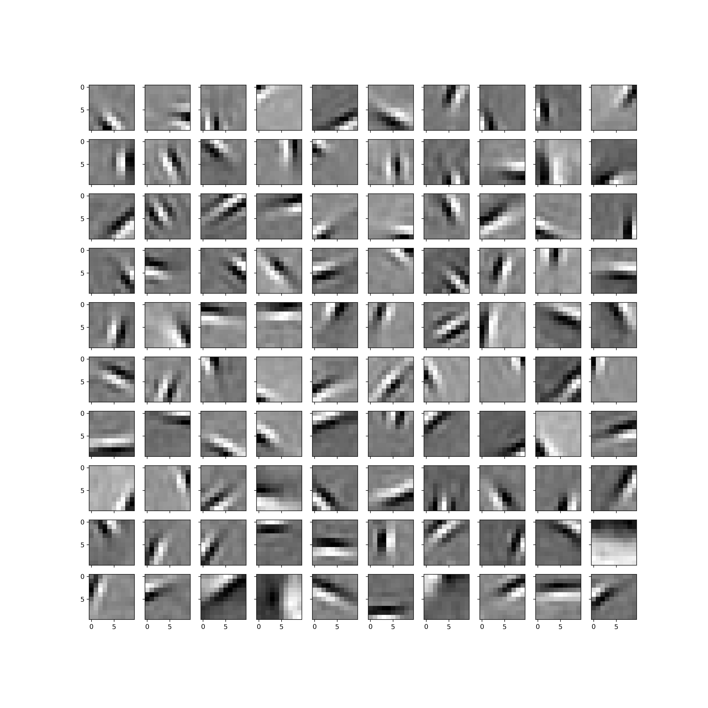

# Sparse Coding



This is an implementation of Olshausen and Field's sparse coding paper in PyTorch. Iterative Shrinkage/Thresholding Algorithm 
(ISTA) is used to fit neuronal responses for the input. Gradients for receptive fields are calculated through PyTorh's autograd
feature. 

## Run
To run the program:
```python
cd src/scripts
python train.py 
```
To see a list of available hyperparameters to change:
```python
python train.py -h
```
A checkpoint of the model is saved every 10 epochs to `trained_models`. To see the tensorboard logs:
```python
tensorboard --logdir=runs
```

## Will be added soon
* Fast-ISTA

## References
* Olshausen, B. A., & Field, D. J. (1996). Emergence of simple-cell receptive field properties by learning a sparse code for natural images. Nature, 381(6583), 607–609. https://doi.org/10.1038/381607a0
* IMAGES.mat is downloaded from Olshausen's original Matlab implementation website: http://www.rctn.org/bruno/sparsenet/